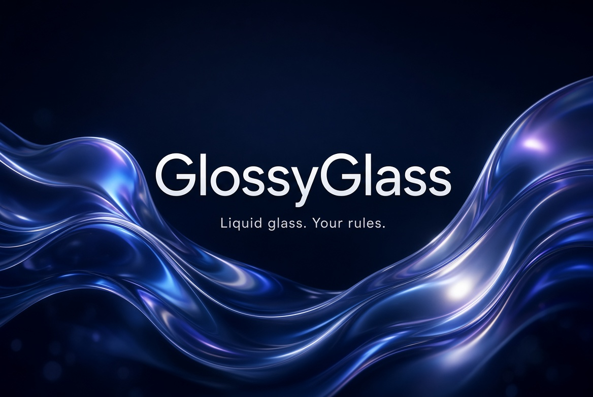

<p align="center">
  
</p>

<h1 align="center">GlossyGlass v4</h1>
<p align="center"><b>The biggest update yet — liquid glass for iOS 17–18.x</b></p>

<p align="center">
  
  
  
</p>

<p align="center">Made by <b>Killswitch</b> · <a href="https://discord.gg/Sxtn7SjDvu">discord.gg/Sxtn7SjDvu</a></p>

---

## What’s new in v4

- **Welcome + loading animation** on first start  
- **Liquid glass theme engine** (Liquid / Heavy recipes)  
- Stronger injection (lower attach thresholds, faster container Force Show)  
- Live Container ready-gate + multi-window (from 3.6.1, tightened)  
- Glass button + nav/tab chrome pass  
- API **v40**: `presentWelcome`, `applyLiquidGlassLook`, `applyLiquidHeavyLook`  
- Settings: Liquid quick theme  

## Install

1. [Releases](../../releases) → `GlossyGlass.dylib`  
2. Inject (Ksign / Esign / Scarlet / Feather / LiveContainer Tweaks folder)  
3. Optional: **DylibLoader v1.1.0** in the same LC folder as `0_DylibLoader.dylib`  

## Live Container

1. App-specific Tweaks folder for the guest app  
2. TweakLoader on (or DylibLoader)  
3. Wait for welcome animation / 15–30s first launch  
4. Force Show if the bar is missing  

## API (v40)

```swift
GlossyGlassAPI.shared.applyLiquidGlassLook()
GlossyGlassAPI.shared.presentWelcome()
GlossyGlassAPI.shared.presentSettings()
GlossyGlassAPI.shared.forceRedetect()
```

---

<p align="center"><b>Killswitch</b> · discord.gg/Sxtn7SjDvu</p>
