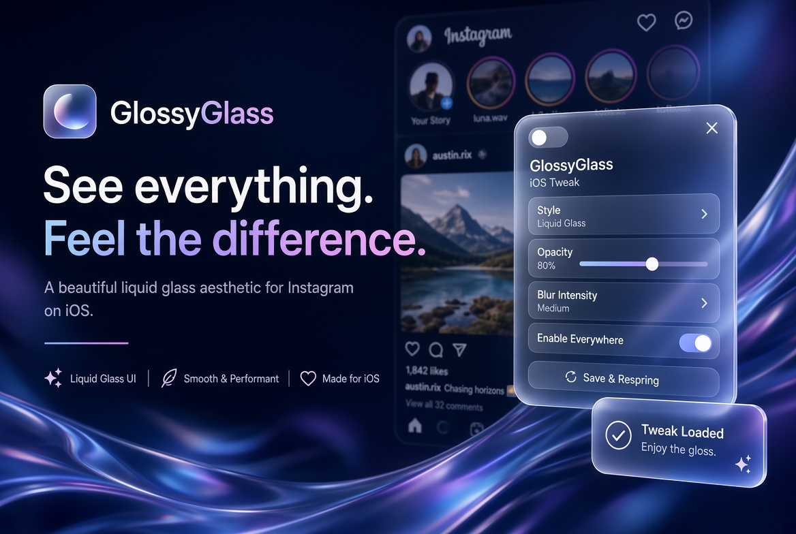
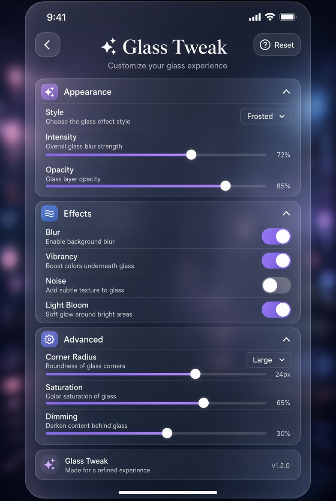
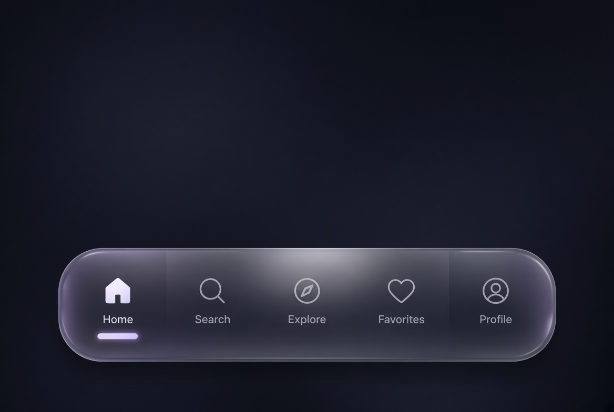

<p align="center">
  
</p>

<h1 align="center">GlossyGlass</h1>
<p align="center">
  <b>Advanced liquid glass UI for iOS 17 – 18.x</b><br>
  Made by <b>Killswitch</b> · <a href="https://discord.gg/Sxtn7SjDvu">discord.gg/Sxtn7SjDvu</a>
</p>

---

### Preview

<p align="center">
  
  &nbsp;&nbsp;
  
</p>

---

### Features

- Automatic start on load  
- Runtime Settings Panel (“Glass” button)  
- **Every setting actually affects the glass**  
- Full layer stack: blur, vibrancy, dimming, tint, noise, gloss, bloom, edge highlight, border  
- Continuous corner curves  
- Separate Light & Dark intensity  
- Frosted / Clear / Tinted styles  
- Presets: Clean · Default · Heavy · Performance  
- Scored injection + single-host lock  
- Hide Glass button  
- Safe Mode  
- Diagnostics panel  
- Long-press lift for messages  
- Reduce Transparency & Reduce Motion support  
- JSON settings export / import  
- Per-screen profile names  
- Public API v3  
- Fully compatible with **iOS 17 & 18.x**

---

### How to Use

1. Go to the [Releases](../../releases) page  
2. Download the latest `GlossyGlass.dylib`  
3. Inject it using your preferred sideloading app  

**Supported:** Ksign · Esign · Scarlet · Feather · and any major sideloading app

---

### Settings

| Section | Controls |
|---------|----------|
| **Appearance** | Style, Intensity, Opacity |
| **Effects** | Blur, Vibrancy, Noise, Light Bloom |
| **Advanced** | Corner Radius, Saturation, Dimming |
| **Extra** | Edge Highlight, Haptics, Safe Mode |
| **Master** | Enable, Lightweight, Hide Button, Nav/Tab/Buttons/Cards |

---

### Public API

```swift
GlossyGlassAPI.shared.setEnabled(true)
GlossyGlassAPI.shared.applyPreset("Heavy")
GlossyGlassAPI.shared.presentSettings()
GlossyGlassAPI.shared.presentDiagnostics()
GlossyGlassAPI.shared.forceRedetect()
GlossyGlassAPI.shared.enterSafeMode()
let json = GlossyGlassAPI.shared.exportSettingsJSON()
```

---

### Notes

- Current version: **v3**  
- No need to build anything — just download from Releases  

<p align="center">
  <b>Made by Killswitch</b><br>
  <a href="https://discord.gg/Sxtn7SjDvu">discord.gg/Sxtn7SjDvu</a>
</p>
